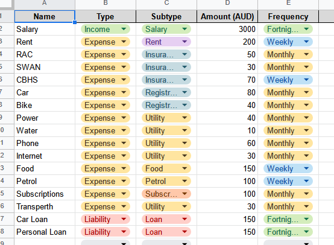
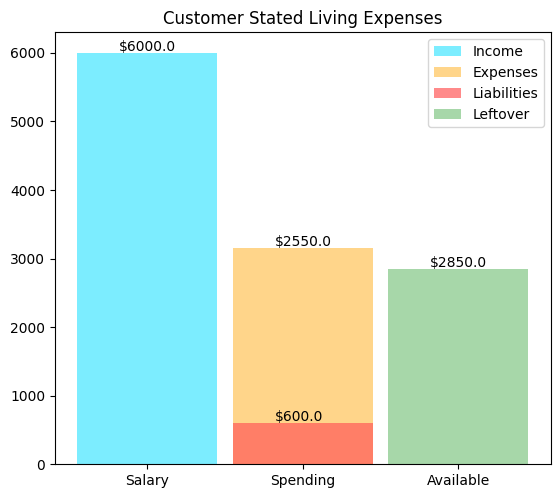
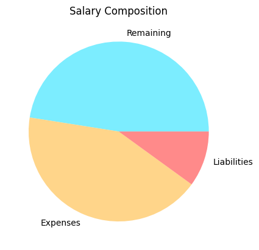
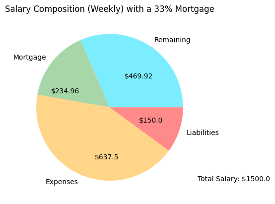

# An Awful Budgeting Visualiser using Python and Google Sheets API

> The following is just the markdown export of `Budgeter.ipynb`
> > Authentication and Sheets Setup is still required by the user

---


```python
import os.path
import json
import pandas as pd
import pickle
import matplotlib.pyplot as plt
from google.auth.transport.requests import Request
from google_auth_oauthlib.flow import InstalledAppFlow
from googleapiclient.discovery import build

```


```python
# If modifying these scopes, delete the file token.json.
SCOPES = ['https://www.googleapis.com/auth/spreadsheets']

# Config
f = open('config.json', 'r')
CONFIG = json.loads(f.read())
f.close()

SPREADSHEET_ID = CONFIG['sheet_id']
SHEET = CONFIG['sheet']
DATA_TO_PULL ='Sheet1!A1:E40'

```


```python
def gsheet_api_check(SCOPES):
    creds = None
    if os.path.exists('token.pickle'):
        with open('token.pickle', 'rb') as token:
            creds = pickle.load(token)
    if not creds or not creds.valid:
        if creds and creds.expired and creds.refresh_token:
            creds.refresh(Request())
        else:
            flow = InstalledAppFlow.from_client_secrets_file(
                'credentials.json', SCOPES)
            creds = flow.run_local_server(port=0)
        with open('token.pickle', 'wb') as token:
            pickle.dump(creds, token)
    return creds

def pull_sheet_data(SCOPES,SPREADSHEET_ID,DATA_TO_PULL):
    print('Connecting to Google Sheets Service')
    print('Authenticating')
    creds = gsheet_api_check(SCOPES)
    print('Retrieving Data')
    service = build('sheets', 'v4', credentials=creds)
    sheet = service.spreadsheets()
    result = sheet.values().get(
        spreadsheetId=SPREADSHEET_ID,
        range=DATA_TO_PULL).execute()
    values = result.get('values', [])
    
    if not values:
        print('No data found.')
    else:
        rows = sheet.values().get(spreadsheetId=SPREADSHEET_ID,
                                  range=DATA_TO_PULL).execute()
        data = rows.get('values')
        print("Finished: Data copied")
        print('Disconnecting from Google Sheets Service')
        return data
```

# Example Spreadsheet

Here we have an example financial tracker spreadsheet



# Lets pull in the data using the Google Sheets API


```python
data = pull_sheet_data(SCOPES,SPREADSHEET_ID,DATA_TO_PULL)
```

    Connecting to Google Sheets Service
    Authenticating
    Retrieving Data
    Finished: Data copied
    Disconnecting from Google Sheets Service
    

# And look at it with a Pandas Dataframe


```python
df = pd.DataFrame(data[1:], columns=data[0])
df
```


<div>
<style scoped>
    .dataframe tbody tr th:only-of-type {
        vertical-align: middle;
    }

    .dataframe tbody tr th {
        vertical-align: top;
    }

    .dataframe thead th {
        text-align: right;
    }
</style>
<table border="1" class="dataframe">
  <thead>
    <tr style="text-align: right;">
      <th></th>
      <th>Name</th>
      <th>Type</th>
      <th>Subtype</th>
      <th>Amount (AUD)</th>
      <th>Frequency</th>
    </tr>
  </thead>
  <tbody>
    <tr>
      <th>0</th>
      <td>Salary</td>
      <td>Income</td>
      <td>Salary</td>
      <td>3000</td>
      <td>Fortnightly</td>
    </tr>
    <tr>
      <th>1</th>
      <td>Rent</td>
      <td>Expense</td>
      <td>Rent</td>
      <td>200</td>
      <td>Weekly</td>
    </tr>
    <tr>
      <th>2</th>
      <td>RAC</td>
      <td>Expense</td>
      <td>Insurance</td>
      <td>50</td>
      <td>Monthly</td>
    </tr>
    <tr>
      <th>3</th>
      <td>SWAN</td>
      <td>Expense</td>
      <td>Insurance</td>
      <td>30</td>
      <td>Monthly</td>
    </tr>
    <tr>
      <th>4</th>
      <td>CBHS</td>
      <td>Expense</td>
      <td>Insurance</td>
      <td>70</td>
      <td>Weekly</td>
    </tr>
    <tr>
      <th>5</th>
      <td>Car</td>
      <td>Expense</td>
      <td>Registration</td>
      <td>80</td>
      <td>Monthly</td>
    </tr>
    <tr>
      <th>6</th>
      <td>Bike</td>
      <td>Expense</td>
      <td>Registration</td>
      <td>40</td>
      <td>Monthly</td>
    </tr>
    <tr>
      <th>7</th>
      <td>Power</td>
      <td>Expense</td>
      <td>Utility</td>
      <td>40</td>
      <td>Monthly</td>
    </tr>
    <tr>
      <th>8</th>
      <td>Water</td>
      <td>Expense</td>
      <td>Utility</td>
      <td>10</td>
      <td>Monthly</td>
    </tr>
    <tr>
      <th>9</th>
      <td>Phone</td>
      <td>Expense</td>
      <td>Utility</td>
      <td>60</td>
      <td>Monthly</td>
    </tr>
    <tr>
      <th>10</th>
      <td>Internet</td>
      <td>Expense</td>
      <td>Utility</td>
      <td>30</td>
      <td>Monthly</td>
    </tr>
    <tr>
      <th>11</th>
      <td>Food</td>
      <td>Expense</td>
      <td>Food</td>
      <td>150</td>
      <td>Weekly</td>
    </tr>
    <tr>
      <th>12</th>
      <td>Petrol</td>
      <td>Expense</td>
      <td>Petrol</td>
      <td>100</td>
      <td>Weekly</td>
    </tr>
    <tr>
      <th>13</th>
      <td>Subscriptions</td>
      <td>Expense</td>
      <td>Subscriptions</td>
      <td>100</td>
      <td>Monthly</td>
    </tr>
    <tr>
      <th>14</th>
      <td>Transperth</td>
      <td>Expense</td>
      <td>Utility</td>
      <td>30</td>
      <td>Monthly</td>
    </tr>
    <tr>
      <th>15</th>
      <td>Car Loan</td>
      <td>Liability</td>
      <td>Loan</td>
      <td>150</td>
      <td>Fortnightly</td>
    </tr>
    <tr>
      <th>16</th>
      <td>Personal Loan</td>
      <td>Liability</td>
      <td>Loan</td>
      <td>150</td>
      <td>Fortnightly</td>
    </tr>
  </tbody>
</table>
</div>


# Here I've created a class for no reason because im an ~~idiot~~


```python
class Transaction():

    def __init__(self, name, type, subtype, amount, frequency):
        self.name = name
        self.type = type
        self.subtype = subtype
        self.amount = float(amount)
        self.frequency = frequency
    
    def get_name(self):
        return self.name

    def get_type(self):
        return self.type

    def get_subtype(self):
        return self.subtype

    def get_amount(self):
        return self.amount

    def get_frequency(self):
        return self.frequency
    
    def get_monthly_amount(self):
        amt = 0.0
        match self.frequency:
            case 'Weekly':
                amt = self.amount * 4.0
            case 'Fortnightly':
                amt = self.amount * 2.0
            case 'Monthly':
                amt = self.amount
            case 'Annually':
                amt = self.amount/12.0
        return round(amt, 2)
    
    def convert_to_monthly(self):
        self.amount = self.get_monthly_amount()
        self.frequency = 'Monthly'

    def __str__(self):
        return f'{self.type} - {self.subtype} - {self.name} - {self.amount} - {self.frequency}'

transactions = []
for i, row in df.iterrows():
    transaction = Transaction(row['Name'], row['Type'], row['Subtype'], row['Amount (AUD)'], row['Frequency'])
    transaction.convert_to_monthly()
    transactions.append(transaction)
```

#### I don't want to talk about it


```python
incomes = 0
expenses = 0
liabilities = 0

for x in transactions:
    match x.get_type():
        case "Income":
            incomes += x.get_amount()
        case "Expense":
            expenses += x.get_amount()
        case "Liability":
            liabilities += x.get_amount()

print(f'Income: {incomes}')
print(f'Expenses: {expenses}')
print(f'Liabilities: {liabilities}')

```

    Income: 6000.0
    Expenses: 2550.0
    Liabilities: 600.0
    

# Yay a graph


```python
plt.bar(1, incomes, width = 0.9, color = (0.27, 0.90, 1.00, 0.7), label='Income')
plt.bar(2, expenses + liabilities, width = 0.9, color=(1.00, 0.77, 0.35, 0.70), label='Expenses')
plt.bar(2, liabilities, width = 0.9, color = (1.00, 0.35, 0.35, 0.70), label='Liabilities')
plt.bar(3, incomes - (expenses + liabilities), width = 0.9, color=(0.51, 0.78, 0.52, 0.70), label='Leftover')

plt.legend()

plt.text(x= 0.82, y= incomes + 30, s = f'${incomes}')
plt.text(x= 1.82, y= expenses + liabilities + 30, s = f'${expenses}')
plt.text(x= 1.82, y= liabilities + 30, s = f'${liabilities}')
plt.text(x= 2.82, y= incomes - (expenses + liabilities) + 30, s = f'${incomes - (expenses + liabilities)}')

plt.subplots_adjust(bottom= 0.1, top = 1.0)

plt.xticks([1, 2, 3], ['Salary', 'Spending', 'Available'])

plt.title('Customer Stated Living Expenses')

plt.show()
```


    

    


# Yay a Pie


```python
plt.pie([incomes - (expenses + liabilities), expenses, liabilities],
    labels = ['Remaining', 'Expenses', 'Liabilities'],
    colors = [ (0.27, 0.90, 1.00, 0.7) , (1.00, 0.77, 0.35, 0.70), (1.00, 0.35, 0.35, 0.70)],
    
    )

plt.title('Salary Composition')

plt.show()
```


    

    


# A Cooler Pie


```python
remaining = incomes - (expenses + liabilities)
remaining = remaining//4
plt.pie([remaining * 0.66, remaining * 0.33, expenses/4, liabilities/4],
    labels = ['Remaining', 'Mortgage', 'Expenses', 'Liabilities'],
    colors = [ (0.27, 0.90, 1.00, 0.7), (0.51, 0.78, 0.52, 0.70), (1.00, 0.77, 0.35, 0.70), (1.00, 0.35, 0.35, 0.70)],
    
    )

plt.title('Salary Composition (Weekly) with a 33% Mortgage')
plt.annotate(f'${remaining * 0.66}', xy=[0.2, 0.4])
plt.annotate(f'${remaining * 0.33}', xy=[-0.8, 0.2])
plt.annotate(f'${expenses/4}', xy=[-0.2, -0.7])
plt.annotate(f'${liabilities/4}', xy=[0.4, -0.2])

plt.annotate(f'Total Salary: ${incomes/4}', xy=[1.2, -1])


plt.show()
```


    

    

